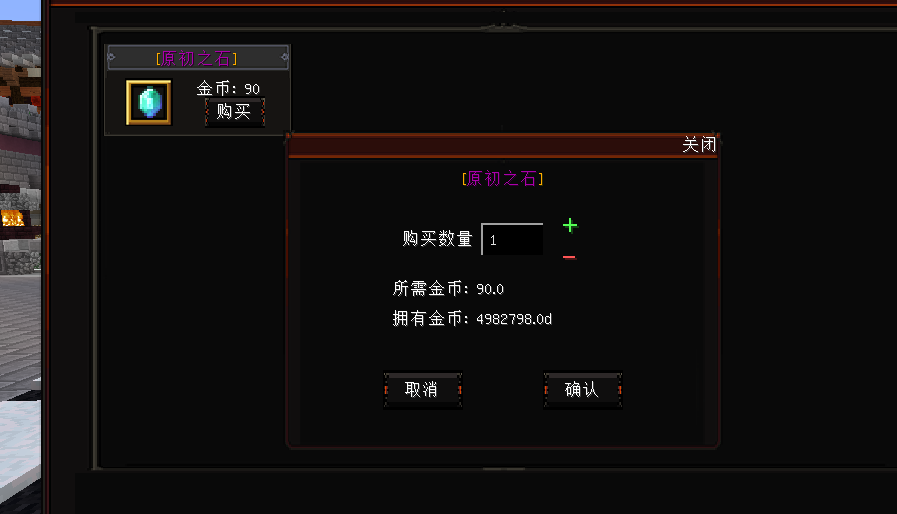

# FomalhautShop
### 北落商店

### 本项目使用 EPL2.0

不允许分发 允许商用 允许自己修改给自己使用

不允许分发修改版本

## 支持开发者
https://afdian.net/a/Ray_Hughes

## 文档
http://ray_hughes.gitee.io/f-shop-doc/

## 功能
+ 出售
+ 收购
+ 限购
+ 以物换物
+ 物+钱换物
+ 多货币
+ 多语言
+ 折扣
+ 优惠券

FomalhautShop
这是一个支持快速管理商品的插件

了解
这个插件脱胎于我的免费插件 Shop 当然 本插件也可以免费获取落后版本（

交流群
830192024

仓库
https://github.com/FxRayHughes/FomalhautShop

支持开发者
https://afdian.net/a/Ray_Hughes

文档
http://ray_hughes.gitee.io/f-shop-doc/

反馈
https://xv5zac7cto.feishu.cn/share/base/form/shrcnwGP21vUKpEWG1hfFyXpyVb

售价
本插件分为两个挡位 为了满足不同需求 但是都是终生可以享有权益 并非年费或月费

终生: 插件的终生 最后一次插件更新时间 + 12个月

I 逗猫棒级 68
你可以：

获得插件最新版
提交BUG
对于插件的意见 (仅参考)
得到插件使用的部分指导
II 猫罐头级 198
你可以:

获得I级所有的权利
对插件提出一些定制化需求 (视情况决定)
得到插件使用的手把手教学